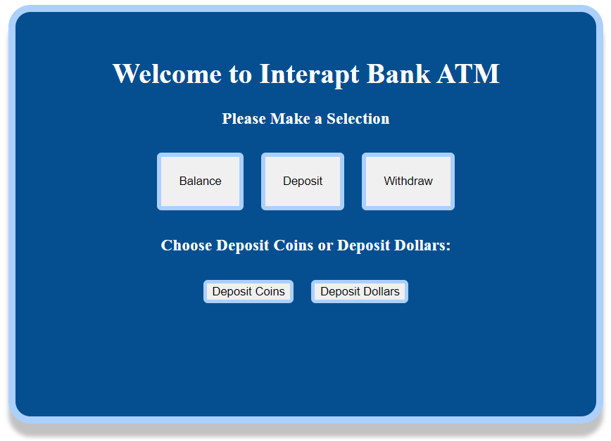

# ATM User Interface:atm::bank:

<h2>Project Overview</h2>
In this project, I implemented an ATM user interface by utilizing basic routing techniques in Angular.
By implementing parent and child routing, I learned how to create a seamless navigation system that enhances the user experience. Also, wildcard routes are added to allow for dynamic and flexible page transitions, enabling users to effortlessly explore different sections of the ATM interface. This project was generated with [Angular CLI](https://github.com/angular/angular-cli) version 16.0.2.

<h2>Packages Used</h2>
Angular CLI 16.0.2, rxjs 7.8.1, & Typescript 5.0.4

<h2>Image of ATM User Interface</h2>

  
## Development Server

Run `ng serve` for a dev server. Navigate to `http://localhost:4200/`. The application will automatically reload if you change any of the source files.

## Code Scaffolding

Run `ng generate component component-name` to generate a new component. You can also use `ng generate directive|pipe|service|class|guard|interface|enum|module`.

## Build

Run `ng build` to build the project. The build artifacts will be stored in the `dist/` directory.

## Routes & Components Used

|                  URL                  |         Components        | Create New Component Commands |
|:-------------------------------------:|:-------------------------:|-------------------------------|
| http://localhost:4200/balance         | Balance Component         | ng g c balance                |
| http://localhost:4200/withdraw        | Withdraw Component        | ng g c withdraw               |
| http://localhost:4200/deposit         | Deposit Component         | ng g c deposit                |
| http://localhost:4200/deposit/coins   | Deposit Coins Component   | ng g c deposit-coins          |
| http://localhost:4200/deposit/dollars | Deposit Dollars Component | ng g c deposit-dollars        |
| http://localhost:4200/notfound        | Page Not Found (404)      | ng g c pagenotfound           |

## What I Learned :bulb:
Throughout this project, I had the opportunity to practice routing and component integration beyond my bootcamp curriculum. I discovered that routing offers several valuable benefits for application development. First, routing allows for clear separation of different areas within the app, enhancing organization and maintainability. By defining distinct routes, we can compartmentalize functionalities and ensure smooth navigation. 

Additionally, routing facilitates effective state management within the app. By associating routes with specific components, we can maintain state independently, improving encapsulation and reducing side effects. This approach enhances the reliability and scalability of the application. 

In summary, this project provided hands-on experience with routing, highlighting its ability to separate app areas, and maintain state. By mastering these concepts, I am better prepared to develop well-structured applications in the future.

## Running Unit Tests

Run `ng test` to execute the unit tests via [Karma](https://karma-runner.github.io).

## Running End-to-End Tests

Run `ng e2e` to execute the end-to-end tests via a platform of your choice. To use this command, you need to first add a package that implements end-to-end testing capabilities.

